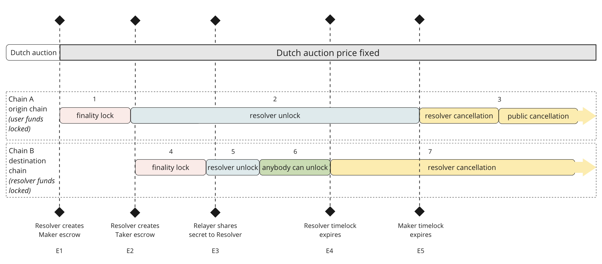

# 1inch Network Fusion Atomic Swaps

[](https://github.com/1inch/cross-chain-swap/actions)
[](https://codecov.io/gh/1inch/cross-chain-swap)

Atomic Swap is a two-party swap mechanism, optimized for EVM-compatible chains with well-aligned incentives to ensure fair and fast execution for all participants.

This protocol implies some off-chain mechanism to verify the created escrow and distribute user defined secret.

## Design
### Key protocol entities
- `EscrowSrc` clones hold the user's tokens and `EscrowDst` clones hold the resolver's tokens. Both allow tokens to be withdrawn to the recipient.
- `EscrowFactory` deploys `EscrowSrc` and `EscrowDst` clones for each swap.

### General concept
#### Set up two escrows
Resolvers play a major role in the execution of transactions. The user off-chain signs an order, which the Resolver then executes on-chain via the [Limit Order Protocol](https://github.com/1inch/limit-order-protocol). As a result, an `EscrowSrc` clone is created on the source chain, where the user's tokens are stored. Then, Resolver deploys the `EscrowDst` clone to the destination chain and deposits tokens that will go to the user at the end of the swap. Also, Resolver deposits in escrow clones safety deposit in native tokens on both chains.

Important aspects of deploying clone contracts:
- The swap parameters used to deploy both clones must be relevant and match where applicable, otherwise the secret will not be given to the Resolver. This applies, for example, to the hash of an order or of a user's secret.
- Unlike a regular token swap, the taking token in the order will not be the token the user wants to receive, but a token that always returns `true` instead of a transfer. This is due to the need to send real taking tokens to a user on a different chain.

#### Withdraw tokens
Once the Resolver has received the secret, it becomes possible to use it to withdraw tokens to the user on the destination chain and to the Resolver itself on the source chain. If the Resolver fails to withdraw tokens to a user within a certain period of time, this option is open to all other Resolvers. The motivation for them to do so is the safety deposit, which is sent to the token withdrawer.

#### Cancel swap
If none of the Resolvers wanted to withdraw tokens to the user on the destination chain, then after a certain period the Resolver can cancel the escrow and reclaim their tokens. The same possibility arises for a Resolver after some time on the source chain, but in this case the tokens will be sent back to the user. If the Resolver has not cancelled the escrow on the source chain within a certain period of time, this option is available to other Resolvers. The motivation for them is the same as for withdrawals: the safety deposit is sent to the one who cancels the escrow.

### Timelocks
The time periods in which certain escrow operations are available are defined by `Timelocks`. They contain the duration of the periods in seconds relative to the deployment timestamp. To get information about a particular period, including its start, the `TimelocksLib` library is used. The following image shows the periods and their mutual arrangement:


*Key stages of Atomic Swap*

### Rescue funds
After a period set when `EscrowSrc` and `EscrowDst` contracts are deployed, Resolver has an option to withdraw assets that are accidentally stuck on a contract. The `rescueFunds` function is implemented for this purpose.

### Contracts deployed once for the chain
For each chain participating in the Atomic Swap mechanism, one copy of the `EscrowSrc`, `EscrowDst` and `EscrowFactory` contracts is deployed. They each contain a set of functions that need to be called to execute the swap.

### One-time contracts for each swap
The `EscrowSrc` or `EscrowDst` contract itself does not hold tokens for the swap. Instead, for each swap, a proxy contract is deployed on each of the chains involved in the swap. Address of the contract is determined by the swap parameters.

To deploy a proxy contract on the source chain the order signed by the user must be filled. On the destination chain call the `createEscrowDst` function.

### Functions for Resolver to use
#### Deploy Escrow clones
1. `EscrowFactory.addressOfEscrowSrc` to get the future `EscrowSrc` clone contract address on the source chain. This is to send the safety deposit in native tokens before the order is filled.
2. Limit Order Protocol [OrderMixin.sol](https://github.com/1inch/limit-order-protocol/blob/master/contracts/OrderMixin.sol):
    - `fillOrderArgs` or `fillContractOrderArgs` to fill the Fusion order and deploy the `EscrowSrc` clone on the source chain.
3. `EscrowFactory.createDstEscrow` on the destination chain to deploy the `EscrowDst` clone.

#### Withdraw tokens
1. `Escrow.withdraw` to withdraw tokens.
2. `Escrow.withdrawTo` to withdraw tokens to the specified address on the source chain.


#### Cancel escrows
2. `Escrow.cancelSrc`.

## Security considerations
The security of protocol transactions is affected by the off-chain distribution of the user's secret. It is recommended to pay proper attention to the implementation of this process.

## Local development

This project uses [Foundry](https://github.com/foundry-rs/foundry) for smart contract development in Solidity. Foundry is a fast, portable, and modular toolkit designed to compile, test, and deploy Solidity contracts.

### Prerequisites

- Ensure you have [Rust](https://www.rust-lang.org/tools/install) installed.
- To [install Foundry](https://book.getfoundry.sh/getting-started/installation), including the `forge` tool, follow these steps:

  ``` shell
  # Install Foundryup:
  curl -L https://foundry.paradigm.xyz | bash
  
  # Apply updated config to current terminal session
  source ~/.zshenv
  
  # Install forge, cast, anvil, and chisel
  foundryup
  ```

### Build

To install submodules and compile contracts run:

``` shell
forge build
```

### Test

To execute tests run:

``` shell
yarn test
```

## How to setup pre-commit hooks

Run the following commands in your terminal:
```bash
chmod +x hooks/pre-commit && cp hooks/pre-commit .git/hooks/pre-commit
```
